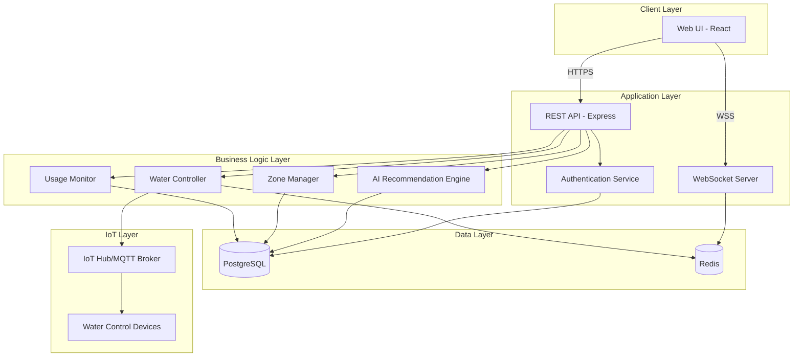

# Design Document: Smart Water Management System

## Overview

The Smart Water Management System is a web-based application that provides users with intelligent control over water distribution in their homes. The system integrates with IoT water control devices to enable precise, zone-based water deployment while leveraging AI to analyze usage patterns and provide optimization recommendations.

The application follows a modern three-tier architecture:
- **Frontend**: React-based single-page application with responsive design
- **Backend**: RESTful API built with Node.js/Express
- **Data Layer**: PostgreSQL database for persistent storage, Redis for real-time state management

The system emphasizes real-time updates, user-friendly controls, and data-driven insights to promote water conservation.

## Architecture

### System Architecture Diagram



### Technology Stack

**Frontend:**
- React 18+ with TypeScript
- Material-UI (MUI) for component library
- Recharts for data visualization
- Socket.io-client for real-time updates
- Axios for HTTP requests

**Backend:**
- Node.js 18+ with Express
- TypeScript for type safety
- Socket.io for WebSocket communication
- JWT for authentication
- MQTT.js for IoT device communication

**Data Storage:**
- PostgreSQL 14+ for relational data
- Redis 7+ for session management and real-time state
- Time-series data optimization for usage metrics

**AI/ML:**
- TensorFlow.js for pattern recognition
- Simple statistical models for baseline calculations
- Anomaly detection for leak identification

## Components and Interfaces

### Frontend Components

#### 1. Dashboard Component
**Responsibility**: Main interface displaying zones, usage statistics, and controls

**Key Features:**
- Grid layout of zone cards
- Real-time usage metrics display
- AI recommendation panel
- Emergency shutoff button

**State Management:**
```typescript
interface DashboardState {
  zones: Zone[];
  selectedZone: Zone | null;
  totalUsage: UsageStats;
  recommendations: Recommendation[];
  emergencyMode: boolean;
}
```

#### 2. Zone Card Component
**Responsibility**: Display individual zone information and controls

**Props:**
```typescript
interface ZoneCardProps {
  zone: Zone;
  isSelected: boolean;
  onSelect: (zoneId: string) => void;
  onDeploy: (zoneId: string, liters: number) => void;
}
```

**Visual States:**
- Idle (default)
- Selected (highlighted)
- Active (water deploying)
- Error (deployment failed)

#### 3. Water Deployment Control Component
**Responsibility**: Input and control for water deployment

**Features:**
- Numeric input with validation (1-1000 liters)
- Quick-select buttons (10L, 25L, 50L, 100L)
- Deploy button with confirmation
- Real-time progress bar during deployment

#### 4. Usage Monitor Component
**Responsibility**: Display historical usage data and trends

**Features:**
- Time range selector (day/week/month)
- Line chart for usage trends
- Bar chart for zone comparison
- Savings calculation display

#### 5. AI Recommendations Panel
**Responsibility**: Display and manage AI-generated recommendations

**Features:**
- List of active recommendations
- Explanation text for each recommendation
- Accept/Dismiss actions
- Estimated savings display

#### 6. Zone Configuration Component
**Responsibility**: Manage zone setup and settings

**Features:**
- Add/Edit/Delete zone operations
- Zone name input
- Zone type selection
- Maximum volume limits per zone

### Backend Components

#### 1. Authentication Service
**Responsibility**: Handle user authentication and session management

**API Endpoints:**
```typescript
POST /api/auth/login
  Request: { username: string, password: string }
  Response: { token: string, user: User }

POST /api/auth/logout
  Request: { token: string }
  Response: { success: boolean }

GET /api/auth/verify
  Request: Headers { Authorization: "Bearer <token>" }
  Response: { valid: boolean, user: User }
```

**Security:**
- Passwords hashed with bcrypt (10 rounds)
- JWT tokens with 24-hour expiration
- Refresh token mechanism for extended sessions
- Rate limiting on login attempts (5 attempts per 15 minutes)

#### 2. Water Controller
**Responsibility**: Interface with IoT devices to control water flow

**API Endpoints:**
```typescript
POST /api/water/deploy
  Request: { zoneId: string, liters: number }
  Response: { deploymentId: string, status: string }

POST /api/water/stop
  Request: { deploymentId: string }
  Response: { success: boolean }

POST /api/water/emergency-stop
  Request: {}
  Response: { success: boolean, stoppedDeployments: string[] }

GET /api/water/status/:deploymentId
  Request: {}
  Response: { status: string, progress: number, litersDeployed: number }
```

**IoT Communication:**
- MQTT protocol for device communication
- Topics: `house/{houseId}/zone/{zoneId}/command` and `house/{houseId}/zone/{zoneId}/status`
- Command messages: `{ action: "deploy", liters: number, deploymentId: string }`
- Status messages: `{ deploymentId: string, status: string, litersDeployed: number }`

**State Management:**
- Active deployments stored in Redis with TTL
- Deployment progress updated every second
- Automatic timeout after 10 minutes of inactivity

#### 3. Usage Monitor
**Responsibility**: Track and analyze water consumption

**API Endpoints:**
```typescript
GET /api/usage/current
  Request: { timeRange: "day" | "week" | "month" }
  Response: { total: number, byZone: Record<string, number>, savings: number }

GET /api/usage/history/:zoneId
  Request: { startDate: string, endDate: string }
  Response: { data: UsageDataPoint[] }

GET /api/usage/savings
  Request: {}
  Response: { totalSaved: number, percentageReduction: number, costSavings: number }
```

**Data Collection:**
- Record every deployment with timestamp, zone, volume
- Aggregate data hourly for trend analysis
- Calculate rolling averages for baseline comparison

#### 4. Zone Manager
**Responsibility**: Manage zone configuration and metadata

**API Endpoints:**
```typescript
GET /api/zones
  Request: {}
  Response: { zones: Zone[] }

POST /api/zones
  Request: { name: string, type: string, maxVolume?: number }
  Response: { zone: Zone }

PUT /api/zones/:zoneId
  Request: { name?: string, type?: string, maxVolume?: number }
  Response: { zone: Zone }

DELETE /api/zones/:zoneId
  Request: {}
  Response: { success: boolean }
```

**Validation:**
- Zone names must be 1-50 characters
- Maximum 20 zones per household
- Zone IDs are UUIDs
- Prevent deletion of zones with active deployments

#### 5. AI Recommendation Engine
**Responsibility**: Generate intelligent water usage recommendations

**API Endpoints:**
```typescript
GET /api/recommendations
  Request: {}
  Response: { recommendations: Recommendation[] }

POST /api/recommendations/:id/accept
  Request: {}
  Response: { success: boolean, appliedSettings: any }

POST /api/recommendations/:id/dismiss
  Request: {}
  Response: { success: boolean }
```

**Recommendation Types:**
1. **Volume Optimization**: Suggest reduced volumes for zones with consistent over-deployment
2. **Schedule Optimization**: Recommend optimal times for water deployment (e.g., garden watering)
3. **Leak Detection**: Alert on unusual usage patterns indicating potential leaks
4. **Seasonal Adjustment**: Adjust recommendations based on seasonal patterns

**Algorithm:**
```typescript
function generateRecommendations(usageHistory: UsageData[]): Recommendation[] {
  const recommendations: Recommendation[] = [];
  
  // Analyze each zone
  for (const zone of zones) {
    const zoneUsage = filterByZone(usageHistory, zone.id);
    const average = calculateAverage(zoneUsage);
    const stdDev = calculateStdDev(zoneUsage);
    
    // Check for consistent over-deployment
    if (average > zone.optimalVolume * 1.2) {
      recommendations.push({
        type: "volume_optimization",
        zoneId: zone.id,
        currentAverage: average,
        suggestedVolume: zone.optimalVolume,
        estimatedSavings: (average - zone.optimalVolume) * 30, // monthly
        reasoning: "Historical data shows consistent over-deployment"
      });
    }
    
    // Check for anomalies (potential leaks)
    const recentUsage = getLast24Hours(zoneUsage);
    if (hasAnomaly(recentUsage, average, stdDev)) {
      recommendations.push({
        type: "leak_detection",
        zoneId: zone.id,
        severity: "high",
        reasoning: "Unusual usage pattern detected"
      });
    }
  }
  
  return recommendations;
}
```

### WebSocket Communication

**Real-Time Events:**
```typescript
// Client subscribes to updates
socket.emit("subscribe", { zoneIds: ["zone1", "zone2"] });

// Server broadcasts deployment progress
socket.emit("deployment:progress", {
  deploymentId: "dep123",
  zoneId: "zone1",
  progress: 45,
  litersDeployed: 22.5,
  litersRemaining: 27.5
});

// Server broadcasts deployment completion
socket.emit("deployment:complete", {
  deploymentId: "dep123",
  zoneId: "zone1",
  totalLiters: 50
});

// Server broadcasts emergency stop
socket.emit("emergency:activated", {
  stoppedDeployments: ["dep123", "dep124"]
});
```

## Data Models

### User
```typescript
interface User {
  id: string;              // UUID
  username: string;        // Unique, 3-30 characters
  passwordHash: string;    // bcrypt hash
  email: string;           // Valid email format
  createdAt: Date;
  lastLogin: Date;
}
```

**Database Schema:**
```sql
CREATE TABLE users (
  id UUID PRIMARY KEY DEFAULT gen_random_uuid(),
  username VARCHAR(30) UNIQUE NOT NULL,
  password_hash VARCHAR(255) NOT NULL,
  email VARCHAR(255) UNIQUE NOT NULL,
  created_at TIMESTAMP DEFAULT CURRENT_TIMESTAMP,
  last_login TIMESTAMP
);

CREATE INDEX idx_users_username ON users(username);
CREATE INDEX idx_users_email ON users(email);
```

### Zone
```typescript
interface Zone {
  id: string;              // UUID
  userId: string;          // Foreign key to User
  name: string;            // 1-50 characters
  type: ZoneType;          // Enum: kitchen, bathroom, garden, laundry, other
  maxVolume: number;       // Maximum liters per deployment (default: 1000)
  status: ZoneStatus;      // Enum: idle, active, error
  createdAt: Date;
  updatedAt: Date;
}

enum ZoneType {
  KITCHEN = "kitchen",
  BATHROOM = "bathroom",
  GARDEN = "garden",
  LAUNDRY = "laundry",
  OTHER = "other"
}

enum ZoneStatus {
  IDLE = "idle",
  ACTIVE = "active",
  ERROR = "error"
}
```

**Database Schema:**
```sql
CREATE TYPE zone_type AS ENUM ('kitchen', 'bathroom', 'garden', 'laundry', 'other');
CREATE TYPE zone_status AS ENUM ('idle', 'active', 'error');

CREATE TABLE zones (
  id UUID PRIMARY KEY DEFAULT gen_random_uuid(),
  user_id UUID NOT NULL REFERENCES users(id) ON DELETE CASCADE,
  name VARCHAR(50) NOT NULL,
  type zone_type NOT NULL,
  max_volume INTEGER DEFAULT 1000,
  status zone_status DEFAULT 'idle',
  created_at TIMESTAMP DEFAULT CURRENT_TIMESTAMP,
  updated_at TIMESTAMP DEFAULT CURRENT_TIMESTAMP
);

CREATE INDEX idx_zones_user_id ON zones(user_id);
```

### Deployment
```typescript
interface Deployment {
  id: string;              // UUID
  zoneId: string;          // Foreign key to Zone
  requestedLiters: number; // 1-1000
  deployedLiters: number;  // Actual amount deployed
  status: DeploymentStatus;
  startedAt: Date;
  completedAt: Date | null;
  errorMessage: string | null;
}

enum DeploymentStatus {
  PENDING = "pending",
  IN_PROGRESS = "in_progress",
  COMPLETED = "completed",
  FAILED = "failed",
  CANCELLED = "cancelled"
}
```

**Database Schema:**
```sql
CREATE TYPE deployment_status AS ENUM ('pending', 'in_progress', 'completed', 'failed', 'cancelled');

CREATE TABLE deployments (
  id UUID PRIMARY KEY DEFAULT gen_random_uuid(),
  zone_id UUID NOT NULL REFERENCES zones(id) ON DELETE CASCADE,
  requested_liters INTEGER NOT NULL CHECK (requested_liters >= 1 AND requested_liters <= 1000),
  deployed_liters DECIMAL(10, 2) DEFAULT 0,
  status deployment_status DEFAULT 'pending',
  started_at TIMESTAMP DEFAULT CURRENT_TIMESTAMP,
  completed_at TIMESTAMP,
  error_message TEXT
);

CREATE INDEX idx_deployments_zone_id ON deployments(zone_id);
CREATE INDEX idx_deployments_started_at ON deployments(started_at);
CREATE INDEX idx_deployments_status ON deployments(status);
```

### UsageRecord
```typescript
interface UsageRecord {
  id: string;              // UUID
  zoneId: string;          // Foreign key to Zone
  deploymentId: string;    // Foreign key to Deployment
  liters: number;          // Amount of water used
  timestamp: Date;         // When the usage occurred
  cost: number;            // Estimated cost (optional)
}
```

**Database Schema:**
```sql
CREATE TABLE usage_records (
  id UUID PRIMARY KEY DEFAULT gen_random_uuid(),
  zone_id UUID NOT NULL REFERENCES zones(id) ON DELETE CASCADE,
  deployment_id UUID NOT NULL REFERENCES deployments(id) ON DELETE CASCADE,
  liters DECIMAL(10, 2) NOT NULL,
  timestamp TIMESTAMP DEFAULT CURRENT_TIMESTAMP,
  cost DECIMAL(10, 2)
);

CREATE INDEX idx_usage_records_zone_id ON usage_records(zone_id);
CREATE INDEX idx_usage_records_timestamp ON usage_records(timestamp);

-- Optimized for time-series queries
CREATE INDEX idx_usage_records_zone_timestamp ON usage_records(zone_id, timestamp DESC);
```

### Recommendation
```typescript
interface Recommendation {
  id: string;              // UUID
  userId: string;          // Foreign key to User
  type: RecommendationType;
  zoneId: string | null;   // Null for system-wide recommendations
  title: string;
  description: string;
  suggestedAction: any;    // JSON object with action details
  estimatedSavings: number; // Liters per month
  status: RecommendationStatus;
  createdAt: Date;
  expiresAt: Date;
}

enum RecommendationType {
  VOLUME_OPTIMIZATION = "volume_optimization",
  SCHEDULE_OPTIMIZATION = "schedule_optimization",
  LEAK_DETECTION = "leak_detection",
  SEASONAL_ADJUSTMENT = "seasonal_adjustment"
}

enum RecommendationStatus {
  ACTIVE = "active",
  ACCEPTED = "accepted",
  DISMISSED = "dismissed",
  EXPIRED = "expired"
}
```

**Database Schema:**
```sql
CREATE TYPE recommendation_type AS ENUM ('volume_optimization', 'schedule_optimization', 'leak_detection', 'seasonal_adjustment');
CREATE TYPE recommendation_status AS ENUM ('active', 'accepted', 'dismissed', 'expired');

CREATE TABLE recommendations (
  id UUID PRIMARY KEY DEFAULT gen_random_uuid(),
  user_id UUID NOT NULL REFERENCES users(id) ON DELETE CASCADE,
  type recommendation_type NOT NULL,
  zone_id UUID REFERENCES zones(id) ON DELETE CASCADE,
  title VARCHAR(255) NOT NULL,
  description TEXT NOT NULL,
  suggested_action JSONB NOT NULL,
  estimated_savings DECIMAL(10, 2),
  status recommendation_status DEFAULT 'active',
  created_at TIMESTAMP DEFAULT CURRENT_TIMESTAMP,
  expires_at TIMESTAMP
);

CREATE INDEX idx_recommendations_user_id ON recommendations(user_id);
CREATE INDEX idx_recommendations_status ON recommendations(status);
```

### Baseline
```typescript
interface Baseline {
  id: string;              // UUID
  userId: string;          // Foreign key to User
  zoneId: string | null;   // Null for overall baseline
  averageDailyLiters: number;
  calculatedAt: Date;
  periodStart: Date;       // Start of baseline period
  periodEnd: Date;         // End of baseline period (typically 30 days)
}
```

**Database Schema:**
```sql
CREATE TABLE baselines (
  id UUID PRIMARY KEY DEFAULT gen_random_uuid(),
  user_id UUID NOT NULL REFERENCES users(id) ON DELETE CASCADE,
  zone_id UUID REFERENCES zones(id) ON DELETE CASCADE,
  average_daily_liters DECIMAL(10, 2) NOT NULL,
  calculated_at TIMESTAMP DEFAULT CURRENT_TIMESTAMP,
  period_start DATE NOT NULL,
  period_end DATE NOT NULL
);

CREATE INDEX idx_baselines_user_id ON baselines(user_id);
CREATE INDEX idx_baselines_zone_id ON baselines(zone_id);
```


## Correctness Properties

*A property is a characteristic or behavior that should hold true across all valid executions of a system—essentially, a formal statement about what the system should do. Properties serve as the bridge between human-readable specifications and machine-verifiable correctness guarantees.*

### Property Reflection

After analyzing all acceptance criteria, I identified several areas where properties can be consolidated:

**Consolidations Made:**
1. Zone display properties (1.1, 1.4, 1.5) can be combined into a comprehensive "zone information display" property
2. Deployment status properties (2.5, 2.6, 7.4) can be unified into a single "deployment lifecycle" property
3. Usage display properties (3.1, 3.2, 3.6) can be combined into "usage data presentation" property
4. Recommendation properties (4.2, 4.4) can be merged into "recommendation completeness" property
5. Zone CRUD operations (6.1, 6.2, 6.3, 6.6) share persistence validation and can use common round-trip testing

**Properties Eliminated as Redundant:**
- Property for "zone selection enables controls" (1.2) is subsumed by deployment control property (2.1)
- Property for "deployment notification" (2.6) is covered by deployment lifecycle property
- Property for "savings display" (8.3) is covered by savings calculation property (8.2)

### Core Properties

#### Property 1: Zone Information Completeness
*For any* set of configured zones, when the dashboard is loaded, all zones should be displayed with their name, type, status, and any custom settings.

**Validates: Requirements 1.1, 1.4, 1.5**

#### Property 2: Zone Selection Enables Deployment Controls
*For any* zone, when selected in the UI, the water deployment input field and deploy button should become enabled and associated with that zone.

**Validates: Requirements 1.2, 2.1**

#### Property 3: Volume Validation Rejects Invalid Inputs
*For any* water volume value outside the range [1, 1000], attempting to deploy should display an error message and prevent the deployment from starting.

**Validates: Requirements 2.3**

#### Property 4: Valid Deployment Initiates Water Flow
*For any* valid zone and water volume in range [1, 1000], submitting a deployment request should create a deployment record and initiate water flow to the specified zone.

**Validates: Requirements 2.4**

#### Property 5: Deployment Lifecycle Tracking
*For any* active deployment, the system should continuously track and display: deployment status (pending/in_progress/completed/failed), liters deployed, liters remaining, and update the zone status accordingly throughout the lifecycle.

**Validates: Requirements 2.5, 2.6, 7.4**

#### Property 6: Usage Recording Completeness
*For any* completed deployment, a usage record should be created containing the deployment ID, zone ID, liters deployed, and timestamp.

**Validates: Requirements 3.4**

#### Property 7: Usage Aggregation Accuracy
*For any* time period (day/week/month) and set of usage records, the total usage calculation should equal the sum of all liters from deployments within that period.

**Validates: Requirements 3.1, 3.2**

#### Property 8: Savings Calculation Correctness
*For any* baseline and current usage data, the savings calculation should equal (baseline - current usage), and the percentage should equal ((baseline - current) / baseline) * 100.

**Validates: Requirements 3.3, 8.2, 8.4**

#### Property 9: Chart Data Formatting
*For any* set of usage records, the data formatted for chart visualization should preserve all timestamps and values, and be ordered chronologically.

**Validates: Requirements 3.6, 8.5**

#### Property 10: Recommendation Generation from Usage Patterns
*For any* zone with average usage exceeding optimal volume by more than 20%, the AI engine should generate a volume optimization recommendation with estimated savings.

**Validates: Requirements 4.1, 4.3**

#### Property 11: Recommendation Completeness
*For any* generated recommendation, it should include: type, title, description, reasoning, estimated savings, and suggested action.

**Validates: Requirements 4.2, 4.4**

#### Property 12: Seasonal Recommendation Adjustment
*For any* zone with detected seasonal patterns (usage variance > 30% between seasons), recommendations should adjust suggested volumes based on the current season.

**Validates: Requirements 4.5**

#### Property 13: Recommendation Acceptance Applies Settings
*For any* accepted recommendation, the suggested settings should be applied to the target zone and the recommendation status should change to "accepted".

**Validates: Requirements 4.6**

#### Property 14: Authentication Blocks Unauthenticated Access
*For any* request to protected endpoints without a valid authentication token, the system should return a 401 Unauthorized response and not execute the requested action.

**Validates: Requirements 5.1, 5.3**

#### Property 15: Session Persistence
*For any* authenticated user session, subsequent requests with the same valid token should maintain authentication state until the token expires or the user logs out.

**Validates: Requirements 5.5**

#### Property 16: Zone Creation Persistence Round-Trip
*For any* valid zone data (name, type, maxVolume), creating a zone and then retrieving it should return an equivalent zone with all fields preserved and a unique ID assigned.

**Validates: Requirements 6.1, 6.4, 6.6**

#### Property 17: Zone Update Persistence Round-Trip
*For any* existing zone and valid update data, updating the zone and then retrieving it should return the zone with updated fields preserved.

**Validates: Requirements 6.2, 6.6**

#### Property 18: Zone Deletion Removes Data
*For any* existing zone without active deployments, deleting the zone should remove it from the database such that subsequent retrieval attempts return not found.

**Validates: Requirements 6.3**

#### Property 19: Deployment Failure Notification
*For any* deployment that fails or encounters an error, the system should emit an error notification containing the deployment ID, zone ID, and error message.

**Validates: Requirements 7.3**

#### Property 20: Multi-Zone Status Display
*For any* set of zones with at least one in active deployment status, the dashboard should display status information for all zones, with active zones clearly distinguished.

**Validates: Requirements 7.5**

#### Property 21: Baseline Calculation from Historical Data
*For any* 30-day period of usage records, the baseline calculation should equal the average daily liters across all days in the period.

**Validates: Requirements 8.1**

#### Property 22: Emergency Stop Halts All Deployments
*For any* set of active deployments, activating emergency shutoff should immediately change all deployment statuses to "cancelled" and stop water flow to all zones.

**Validates: Requirements 9.2**

#### Property 23: Emergency Stop Notification
*For any* emergency shutoff activation, the system should emit a notification containing the list of all stopped deployment IDs.

**Validates: Requirements 9.3**

#### Property 24: Emergency Mode Blocks New Deployments
*For any* deployment request while emergency mode is active, the system should reject the request with an error indicating emergency mode is active.

**Validates: Requirements 9.4**

#### Property 25: Emergency Mode Requires Explicit Deactivation
*For any* emergency mode activation, the mode should remain active until an explicit deactivation request is received, and should not auto-deactivate.

**Validates: Requirements 9.5**

#### Property 26: Responsive Layout Adaptation
*For any* viewport size change, the UI layout should adapt by applying appropriate CSS media query rules and maintaining all interactive elements in accessible positions.

**Validates: Requirements 10.4**

### Edge Case Properties

These properties focus on boundary conditions and special cases:

#### Property 27: Minimum Volume Boundary
*For any* deployment request with exactly 1 liter, the system should accept and process it successfully.

**Validates: Requirements 2.2 (edge case)**

#### Property 28: Maximum Volume Boundary
*For any* deployment request with exactly 1000 liters, the system should accept and process it successfully.

**Validates: Requirements 2.2 (edge case)**

#### Property 29: Maximum Zones Boundary
*For any* user with exactly 20 zones, the system should allow operations on all zones but reject attempts to create a 21st zone.

**Validates: Requirements 6.5 (edge case)**

#### Property 30: Empty Usage History Handling
*For any* zone with no usage records, requesting usage history should return an empty array without errors, and savings calculations should return zero.

**Validates: Requirements 3.2, 8.2 (edge case)**

## Error Handling

### Error Categories

**1. Validation Errors (400 Bad Request)**
- Invalid water volume (< 1 or > 1000)
- Invalid zone name (empty or > 50 characters)
- Missing required fields
- Invalid data types

**2. Authentication Errors (401 Unauthorized)**
- Missing authentication token
- Expired token
- Invalid token signature
- Incorrect username/password

**3. Authorization Errors (403 Forbidden)**
- Attempting to access another user's zones
- Attempting operations during emergency mode

**4. Resource Errors (404 Not Found)**
- Zone ID does not exist
- Deployment ID does not exist
- User ID does not exist

**5. Conflict Errors (409 Conflict)**
- Attempting to create zone when at maximum (20 zones)
- Attempting to delete zone with active deployment
- Duplicate zone name for same user

**6. IoT Communication Errors (503 Service Unavailable)**
- MQTT broker connection failure
- Device not responding
- Timeout waiting for device acknowledgment

**7. System Errors (500 Internal Server Error)**
- Database connection failure
- Unexpected exceptions
- Data corruption

### Error Response Format

All API errors follow a consistent format:

```typescript
interface ErrorResponse {
  error: {
    code: string;           // Machine-readable error code
    message: string;        // Human-readable error message
    details?: any;          // Optional additional context
    timestamp: string;      // ISO 8601 timestamp
    requestId: string;      // Unique request identifier for tracing
  }
}
```

**Example:**
```json
{
  "error": {
    "code": "INVALID_VOLUME",
    "message": "Water volume must be between 1 and 1000 liters",
    "details": {
      "provided": 1500,
      "min": 1,
      "max": 1000
    },
    "timestamp": "2024-01-15T10:30:00Z",
    "requestId": "req_abc123"
  }
}
```

### Error Handling Strategies

**Frontend Error Handling:**
1. Display user-friendly error messages in toast notifications
2. Highlight invalid form fields with error text
3. Provide retry mechanisms for transient errors
4. Log errors to browser console for debugging
5. Graceful degradation when real-time updates fail

**Backend Error Handling:**
1. Validate all inputs before processing
2. Use try-catch blocks around external service calls
3. Log all errors with context (user ID, request ID, stack trace)
4. Return appropriate HTTP status codes
5. Implement circuit breakers for IoT device communication
6. Rollback database transactions on errors

**IoT Communication Error Handling:**
1. Implement retry logic with exponential backoff (3 attempts)
2. Timeout after 30 seconds of no response
3. Mark deployment as "failed" if device doesn't acknowledge
4. Queue commands when device is offline
5. Alert user when device connectivity issues detected

## Testing Strategy

### Dual Testing Approach

The system will employ both unit testing and property-based testing to ensure comprehensive coverage:

**Unit Tests:**
- Specific examples demonstrating correct behavior
- Edge cases and boundary conditions
- Integration points between components
- Error conditions and exception handling
- Mock external dependencies (database, IoT devices)

**Property-Based Tests:**
- Universal properties that hold for all inputs
- Comprehensive input coverage through randomization
- Minimum 100 iterations per property test
- Each test tagged with feature name and property number

### Testing Tools and Frameworks

**Frontend Testing:**
- **Jest**: Unit test runner
- **React Testing Library**: Component testing
- **fast-check**: Property-based testing library for TypeScript
- **MSW (Mock Service Worker)**: API mocking
- **Cypress**: End-to-end testing

**Backend Testing:**
- **Jest**: Unit test runner
- **Supertest**: HTTP endpoint testing
- **fast-check**: Property-based testing library
- **testcontainers**: Database integration testing
- **MQTT.js mocking**: IoT device simulation

### Property Test Configuration

Each property-based test will:
1. Run minimum 100 iterations with randomized inputs
2. Include a comment tag referencing the design property
3. Use appropriate generators for domain types

**Tag Format:**
```typescript
// Feature: smart-water-management, Property 1: Zone Information Completeness
test("dashboard displays all zone information", () => {
  fc.assert(
    fc.property(fc.array(zoneGenerator()), (zones) => {
      // Test implementation
    }),
    { numRuns: 100 }
  );
});
```

### Test Coverage Goals

- **Unit Test Coverage**: Minimum 80% code coverage
- **Property Test Coverage**: All 30 correctness properties implemented
- **Integration Test Coverage**: All API endpoints tested
- **E2E Test Coverage**: Critical user flows (login, deploy water, view usage)

### Example Property Test Implementation

```typescript
import fc from "fast-check";

// Generator for valid water volumes
const waterVolumeGenerator = () => fc.integer({ min: 1, max: 1000 });

// Generator for zones
const zoneGenerator = () => fc.record({
  id: fc.uuid(),
  name: fc.string({ minLength: 1, maxLength: 50 }),
  type: fc.constantFrom("kitchen", "bathroom", "garden", "laundry", "other"),
  maxVolume: fc.integer({ min: 1, max: 1000 }),
  status: fc.constantFrom("idle", "active", "error")
});

// Feature: smart-water-management, Property 4: Valid Deployment Initiates Water Flow
describe("Water Deployment", () => {
  test("valid deployment creates record and initiates flow", () => {
    fc.assert(
      fc.property(
        zoneGenerator(),
        waterVolumeGenerator(),
        async (zone, volume) => {
          // Setup
          await createZone(zone);
          
          // Execute
          const deployment = await deployWater(zone.id, volume);
          
          // Verify
          expect(deployment).toBeDefined();
          expect(deployment.zoneId).toBe(zone.id);
          expect(deployment.requestedLiters).toBe(volume);
          expect(deployment.status).toBe("pending");
          
          // Verify zone status updated
          const updatedZone = await getZone(zone.id);
          expect(updatedZone.status).toBe("active");
        }
      ),
      { numRuns: 100 }
    );
  });
});

// Feature: smart-water-management, Property 3: Volume Validation Rejects Invalid Inputs
describe("Volume Validation", () => {
  test("invalid volumes are rejected", () => {
    fc.assert(
      fc.property(
        zoneGenerator(),
        fc.integer().filter(n => n < 1 || n > 1000),
        async (zone, invalidVolume) => {
          // Setup
          await createZone(zone);
          
          // Execute and verify
          await expect(deployWater(zone.id, invalidVolume))
            .rejects
            .toThrow(/volume must be between 1 and 1000/i);
          
          // Verify no deployment created
          const deployments = await getDeployments(zone.id);
          expect(deployments).toHaveLength(0);
        }
      ),
      { numRuns: 100 }
    );
  });
});
```

### Unit Test Examples

```typescript
// Example-based tests for specific scenarios
describe("Emergency Shutoff", () => {
  test("emergency button is always visible", () => {
    render(<Dashboard />);
    const emergencyButton = screen.getByRole("button", { name: /emergency/i });
    expect(emergencyButton).toBeVisible();
  });
  
  test("emergency stop cancels all active deployments", async () => {
    // Setup: Create 3 active deployments
    const deployments = await Promise.all([
      deployWater("zone1", 100),
      deployWater("zone2", 200),
      deployWater("zone3", 300)
    ]);
    
    // Execute
    await activateEmergencyStop();
    
    // Verify all deployments cancelled
    for (const deployment of deployments) {
      const updated = await getDeployment(deployment.id);
      expect(updated.status).toBe("cancelled");
    }
  });
});

describe("Baseline Calculation", () => {
  test("baseline is average of 30 days", async () => {
    // Setup: Create 30 days of usage data
    const dailyUsage = [100, 120, 110, 105, 115]; // ... 30 values
    await seedUsageData(dailyUsage);
    
    // Execute
    const baseline = await calculateBaseline();
    
    // Verify
    const expectedAverage = dailyUsage.reduce((a, b) => a + b) / 30;
    expect(baseline.averageDailyLiters).toBeCloseTo(expectedAverage, 2);
  });
});
```

### Integration Testing

Integration tests will verify:
1. **API Endpoint Integration**: All REST endpoints with database
2. **WebSocket Integration**: Real-time updates between server and client
3. **IoT Integration**: MQTT communication with simulated devices
4. **Authentication Flow**: Login, token refresh, logout
5. **End-to-End Flows**: Complete user journeys

### Continuous Integration

All tests will run automatically on:
- Every pull request
- Every commit to main branch
- Nightly builds for extended property test runs (1000+ iterations)

**CI Pipeline:**
1. Lint code (ESLint, Prettier)
2. Type check (TypeScript)
3. Run unit tests
4. Run property-based tests
5. Run integration tests
6. Generate coverage report
7. Run E2E tests (on staging environment)nt Integration**: All REST endpoints with database
2. **WebSocket Integration**: Real-time updates between server and client
3. **IoT Integration**: MQTT communication with simulated devices
4. **Authentication Flow**: Login, token refresh, logout
5. **End-to-End Flows**: Complete user journeys

### Continuous Integration

All tests will run automaticall     const updated = await getDeployment(deployment.id);
      expect(updated.status).toBe("cancelled");
    }
  });
});

describe("Baseline Calculation", () => {
  test("baseline is average of 30 days", async () => {
    // Setup: Create 30 days of usage data
    const dailyUsage = [100, 120, 110, 105, 115, ...]; // 30 values
    await seedUsageData(dailyUsage);
    
    // Execute
    const baseline = await calculateBaseline();
    
    // Verify
    const expectedAverage = dailyUsage.reduce((a, b) => a + b) / 3n = screen.getByRole("button", { name: /emergency/i });
    expect(emergencyButton).toBeVisible();
  });
  
  test("emergency stop cancels all active deployments", async () => {
    // Setup: Create 3 active deployments
    const deployments = await Promise.all([
      deployWater("zone1", 100),
      deployWater("zone2", 200),
      deployWater("zone3", 300)
    ]);
    
    // Execute
    await activateEmergencyStop();
    
    // Verify all deployments cancelled
    for (const deployment of deployments) {
 jects
            .toThrow(/volume must be between 1 and 1000/i);
          
          // Verify no deployment created
          const deployments = await getDeployments(zone.id);
          expect(deployments).toHaveLength(0);
        }
      ),
      { numRuns: 100 }
    );
  });
});
```

### Unit Test Examples

```typescript
// Example-based tests for specific scenarios
describe("Emergency Shutoff", () => {
  test("emergency button is always visible", () => {
    render(<Dashboard />);
    const emergencyButto0 }
    );
  });
});

// Feature: smart-water-management, Property 3: Volume Validation Rejects Invalid Inputs
describe("Volume Validation", () => {
  test("invalid volumes are rejected", () => {
    fc.assert(
      fc.property(
        zoneGenerator(),
        fc.integer().filter(n => n < 1 || n > 1000),
        async (zone, invalidVolume) => {
          // Setup
          await createZone(zone);
          
          // Execute and verify
          await expect(deployWater(zone.id, invalidVolume))
            .re   // Execute
          const deployment = await deployWater(zone.id, volume);
          
          // Verify
          expect(deployment).toBeDefined();
          expect(deployment.zoneId).toBe(zone.id);
          expect(deployment.requestedLiters).toBe(volume);
          expect(deployment.status).toBe("pending");
          
          // Verify zone status updated
          const updatedZone = await getZone(zone.id);
          expect(updatedZone.status).toBe("active");
        }
      ),
      { numRuns: 10aundry", "other"),
  maxVolume: fc.integer({ min: 1, max: 1000 }),
  status: fc.constantFrom("idle", "active", "error")
});

// Feature: smart-water-management, Property 4: Valid Deployment Initiates Water Flow
describe("Water Deployment", () => {
  test("valid deployment creates record and initiates flow", () => {
    fc.assert(
      fc.property(
        zoneGenerator(),
        waterVolumeGenerator(),
        async (zone, volume) => {
          // Setup
          await createZone(zone);
          
       gration Test Coverage**: All API endpoints tested
- **E2E Test Coverage**: Critical user flows (login, deploy water, view usage)

### Example Property Test Implementation

```typescript
import fc from "fast-check";

// Generator for valid water volumes
const waterVolumeGenerator = () => fc.integer({ min: 1, max: 1000 });

// Generator for zones
const zoneGenerator = () => fc.record({
  id: fc.uuid(),
  name: fc.string({ minLength: 1, maxLength: 50 }),
  type: fc.constantFrom("kitchen", "bathroom", "garden", "lerty
3. Use appropriate generators for domain types

**Tag Format:**
```typescript
// Feature: smart-water-management, Property 1: Zone Information Completeness
test("dashboard displays all zone information", () => {
  fc.assert(
    fc.property(fc.array(zoneGenerator()), (zones) => {
      // Test implementation
    }),
    { numRuns: 100 }
  );
});
```

### Test Coverage Goals

- **Unit Test Coverage**: Minimum 80% code coverage
- **Property Test Coverage**: All 30 correctness properties implemented
- **Inteesting library for TypeScript
- **MSW (Mock Service Worker)**: API mocking
- **Cypress**: End-to-end testing

**Backend Testing:**
- **Jest**: Unit test runner
- **Supertest**: HTTP endpoint testing
- **fast-check**: Property-based testing library
- **testcontainers**: Database integration testing
- **MQTT.js mocking**: IoT device simulation

### Property Test Configuration

Each property-based test will:
1. Run minimum 100 iterations with randomized inputs
2. Include a comment tag referencing the design propon points between components
- Error conditions and exception handling
- Mock external dependencies (database, IoT devices)

**Property-Based Tests:**
- Universal properties that hold for all inputs
- Comprehensive input coverage through randomization
- Minimum 100 iterations per property test
- Each test tagged with feature name and property number

### Testing Tools and Frameworks

**Frontend Testing:**
- **Jest**: Unit test runner
- **React Testing Library**: Component testing
- **fast-check**: Property-based t